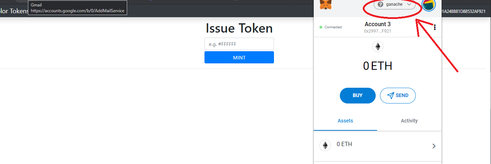

# NFT-Token-Mint
Mint your own NFT tokens (ERC721) on the blockchain in any color.

1. install ganache, run locally
2. cd folder, npm run start
3. change metamask network to ganache, import priv key for test eth
4. enter color hex and mint

